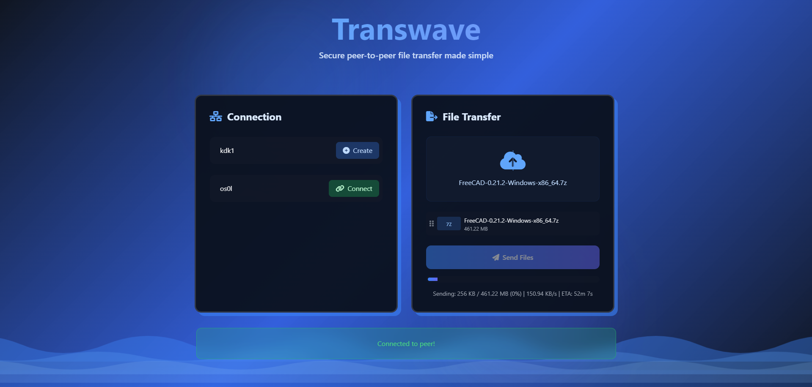

# Transwave

A secure peer-to-peer file transfer web application that allows direct file sharing between browsers.

## Features

- Direct browser-to-browser file transfer
- No server storage - files are transferred directly between peers
- Modern, responsive UI with animated wave effects
- Real-time transfer progress and speed monitoring
- Support for multiple file transfers
- Adaptive chunk size and window size for optimal performance
- File queue management
- Connection status indicators
- End-to-end encryption for all file transfers
- Secure key exchange using ECDH
- AES-GCM encryption for file chunks
- Checksum verification for file integrity
- Drag and drop file support
- Sortable file queue
- Visual transfer progress with wave animation

## How to Use

1. Open the application in your browser
2. Create a new peer ID or use an automatically generated one
3. Share your peer ID with the person you want to transfer files to
4. The other person enters your peer ID and connects
5. Once connected, either party can:
   - Select files by clicking the upload area or dragging files
   - Click "Send Files" to start the transfer
   - Receiving files will automatically trigger a download

## Security Features

- **End-to-End Encryption**: All files are encrypted before transmission
- **ECDH Key Exchange**: Secure key exchange between peers
- **AES-GCM Encryption**: Strong encryption for file chunks
- **No Server Storage**: Files exist only on sender and receiver devices
- **Integrity Verification**: SHA-256 checksums for all transferred files

## Technical Features

- WebRTC-based peer connections using PeerJS
- Chunked file transfer with automatic retry mechanism
- Dynamic transfer optimization
- Responsive design using Tailwind CSS
- Modern glass morphism and neo-brutalism design elements
- End-to-end encryption using Web Crypto API
- ECDH (P-384) for key exchange
- AES-GCM for file encryption
- SHA-256 for file integrity verification
- Sortable.js for queue management
- TailwindCSS for responsive design
- Glass morphism and neo-brutalism UI elements

## Performance

- Adjustable chunk sizes (32KB - 1MB)
- Dynamic window sizing for optimal throughput
- Real-time transfer speed monitoring
- Automatic recovery from connection issues

## Browser Support

Works in modern browsers that support:
- WebRTC
- ES6+ JavaScript
- CSS Grid and Flexbox
- Backdrop Filter
- Web Crypto API
- Secure Context (HTTPS or localhost)

## Setup

1. Clone the repository
2. Open index.html in a modern web browser
3. No additional setup required - the application uses CDN-hosted dependencies
